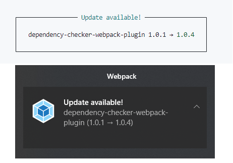

<div align="center">
  <a href="https://github.com/webpack/webpack">
    
  </a>

  [![npm][npm]][npm-url]
  [![node][node]][node-url]
  
  [![size][size]][size-url]

  <h1>Dependency Checker Webpack Plugin</h1>
  <p>Plugin that simplifies checke of dependensies version and notify at new versions.</p>
</div>

<h2 align="center">Install</h2>

<h3>Webpack 5</h3>

```bash
  npm i --save-dev dependency-checker-webpack-plugin
```

```bash
  yarn add --dev dependency-checker-webpack-plugin
```
<h2 align="center">Use</h2>

The plugin will output information in the console and toast of Windows, MacOS or Linux, for this you need to add it as below and add the package names to the dependency list for checking:

**webpack.config.js**

```js
import DependencyCheckerPlugin from 'dependency-checker-webpack-plugin';

module.exports = {
  ...
  plugins: [new DependencyCheckerPlugin({
    depNames: ['dependency-checker-webpack-plugin']
  })],
  ...
};
```
It will create a notification for dependencies that have new versions.
<div align="center">
  
</div>

<h2 align="center">Settings</h2>

```js
new DependencyCheckerPlugin({
  depNames: array,
  options?: object
})
```

|Name|Type|Default|Description
|:--:|:--:|:--:|:----------|
|**`depNames`**|`{Array.<string>}`|['']|Names of packages to be checked|
|**`options.showToast`**|`{Boolean}`|true|Enable toast of Windows, MacOS or Linux|
|**`options.showConsole`**|`{Boolean}`|true|Enable notify in console|
|**`options.devServerOnly`**|`{Boolean}`|true|For DevServer only|
|**`options.disableCertValid`**|`{Boolean}`|false|NODE_TLS_REJECT_UNAUTHORIZED = 0 or 1|

[npm]: https://img.shields.io/npm/v/dependency-checker-webpack-plugin.svg
[npm-url]: https://npmjs.com/package/dependency-checker-webpack-plugin
[node]: https://img.shields.io/node/v/dependency-checker-webpack-plugin.svg
[node-url]: https://nodejs.org
[size]: https://packagephobia.now.sh/badge?p=dependency-checker-webpack-plugin
[size-url]: https://packagephobia.now.sh/result?p=dependency-checker-webpack-plugin
